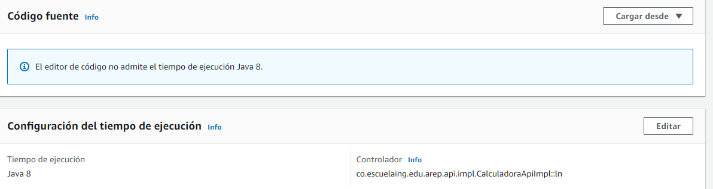
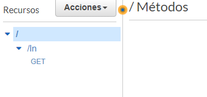

# Parcial Segundo corte lambda

## Autor: Juan Sebastian Ramos Isaza

## Fecha: 26-03-2021

### Prerequisitos
Para el uso de esta aplicación se necesitan tener instalados los siguientes componentes:

* [Java 11 o superior](https://www.oracle.com/co/java/)
* [maven](https://maven.apache.org/)
* [git](https://git-scm.com/)

### Uso 
Para el uso de la apliacion deben clonar el repositorio en su maquina con el comando:
* git clone https://github.com/jsr25/ParcialArep2Lambda.git

debemos entrar en la raiz de proyecto y ejecutar
* mvn package 

luego debemos entrar en aws y subir el jar generado y especificar la calse y el metodo que se usara 

luego de tener la funcion lambda entraremos en el apigateway donde realizaremos creamos un metodo, un recurso e implementaremos una api
como se muestra en la siguiente imagen

## video
https://www.youtube.com/watch?v=MWZwHlQWTeg&ab_channel=JuanRamos en este video podemos pueden observar la implementacion de lambda 

### Javadoc
La documentación se encuentra en el directorio apidocs dentro el directorio Robin y LogService, para generar una nueva documentación
pueden hacer uso del comando mvn javadoc:javadoc en su Shell esta se generará en el directorio target/site.

### Licencia

En este proyecto se usó la licencia GNU - se puede ver [LICENSE.txt](LICENSE.txt) para más detalles.
